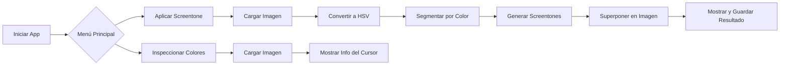

# screentone-converter

# Aplicación de Screentone

Una aplicación con interfaz gráfica para procesamiento de imágenes que permite a los usuarios:

* **Aplicar texturas de screentone** a regiones de imagen según rangos de color HSV detectados.
* **Inspeccionar valores de color a nivel de píxel** mediante un visor interactivo.

Esta herramienta está diseñada pensando en la accesibilidad, útil para tareas como estilización de imágenes, renderizado artístico o visualización adaptativa.

---

## 🖼 Características

* **Segmentación de color** basada en HSV
* Superposición dinámica de **patrones** (rayas, puntos, grillas)
* **Escalado ajustable** de patrones según el tamaño de imagen
* **Combinación alfa** para superposición no destructiva
* Inspector interactivo de **nombres de color** (nombre CSS3 más cercano)
* Menús GUI para navegación sencilla

---

## 📁 Estructura del Proyecto

```
screentone_app/
├── __init__.py
├── main.py                  # Lanzador del menú principal
├── image_loader.py          # Carga de imágenes
├── color_ranges.py          # Rangos HSV por color
├── patterns.py              # Generadores de texturas de screentone
├── screentone_processor.py  # Lógica principal del screentone
├── screentone_gui.py        # Ejecuta la GUI del screentone
├── color_inspector.py       # Herramienta para inspección de color
├── color_inspector_gui.py   # Interfaz para lanzar el inspector
├── utils.py                 # (Opcional) utilidades
└── requirements.txt         # Dependencias
```

---

## ▶️ Cómo Ejecutar

1. **Instalar dependencias**:

```bash
pip install -r requirements.txt
```

2. **Iniciar la aplicación**:

```bash
python screentone_app/main.py
```

---

## 💡 Ejemplo de Uso

### 1. Aplicar Screentone

* Abrir una imagen.
* La app detecta regiones por color (ej. rojo, azul, verde).
* Cada región se rellena con un patrón de screentone correspondiente.
* Se guardan la imagen original, la procesada y la combinada.

### 2. Inspeccionar Colores

* Abrir una imagen.
* Mover el cursor para ver valores RGB y nombre de color más cercano.

---

## 🔁 Código de Ejemplo

```python
from screentone_app.image_loader import load_image
from screentone_app.screentone_processor import ScreentoneProcessor

img_rgb, path = load_image()
hsv = cv2.cvtColor(img_rgb, cv2.COLOR_RGB2HSV)
proc = ScreentoneProcessor(img_rgb.shape)
gray = proc.apply(hsv, img_rgb)
final = proc.superimpose(img_rgb, gray)
proc.save(img_rgb, gray, final, path)
```

---

## 🔄 Diagrama de Flujo



---

## Dependencias

```
aiosqlite==0.21.0
alembic==1.15.2
annotated-types==0.7.0
anyio==4.9.0
click==8.2.0
contourpy==1.3.2
cycler==0.12.1
fastapi==0.115.12
fonttools==4.57.0
greenlet==3.2.2
h11==0.16.0
idna==3.10
kiwisolver==1.4.8
Mako==1.3.10
MarkupSafe==3.0.2
matplotlib==3.10.1
numpy==2.2.5
opencv-python==4.11.0.86
packaging==25.0
pillow==11.2.1
pydantic==2.11.4
pydantic_core==2.33.2
pyparsing==3.2.3
python-dateutil==2.9.0.post0
six==1.17.0
sniffio==1.3.1
SQLAlchemy==2.0.41
starlette==0.46.2
typing-inspection==0.4.0
typing_extensions==4.13.2
uvicorn==0.34.2
webcolors==24.11.1
```

---

## ✅ Mejoras Futuras

* Modo CLI para procesamiento por lotes
* Rangos o patrones definidos por el usuario
* Exportación a formatos PDF o vectoriales

